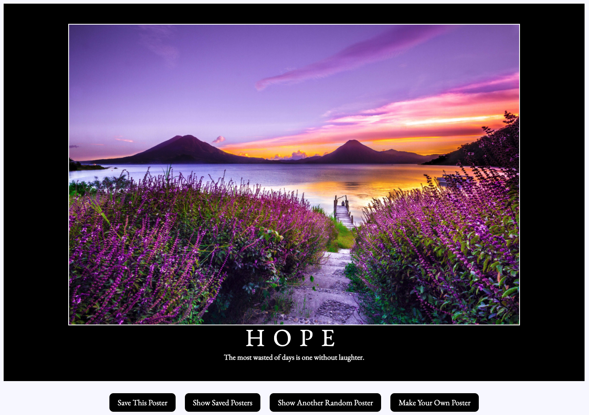
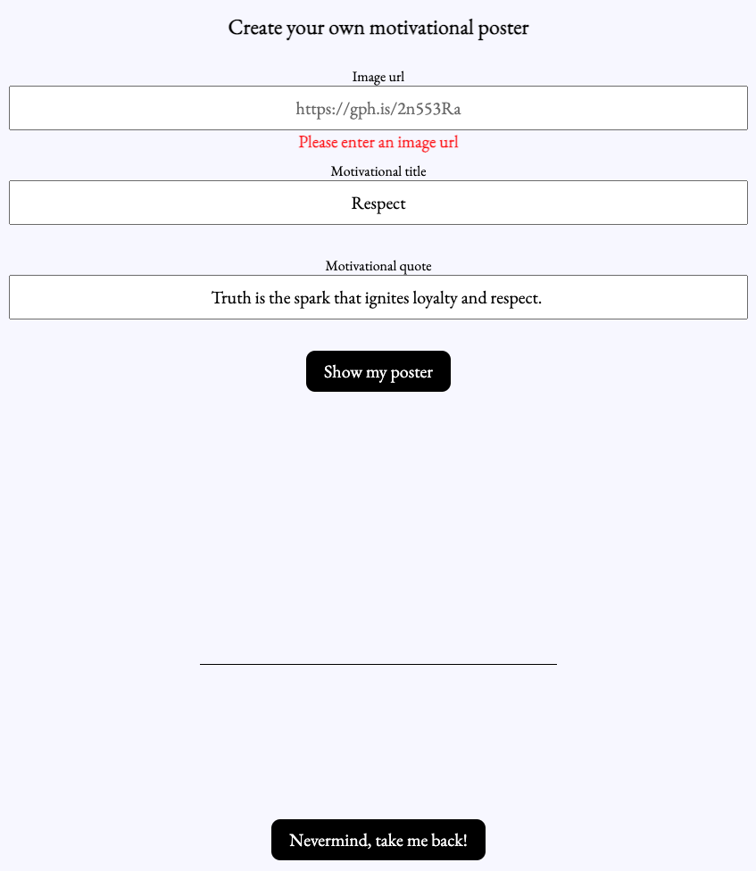

# Hang In There 

Users have the ability to randomly generate, create and save posters. 

  
## Description

Every time the Hang In There website is loaded, the main page will randomly generate a new poster (image, title and quote). The user has the ability to randomly generate another poster by clicking the **Show Another Random Poster** button. 

Select the **Make Your Own Poster** button to fill out a form to create a poster from scratch. An image url, title and quote **all have to be entered** before the **Show my poster** button will work. To return to the main page, without completely filling out the form, click the **Nevermind, take Mel back!** button. To save the newly created poster click the **Save This Poster** button. 

The user has the ability to save their unique posters and randomly generated posters. **Show Saved Posters** will display all of the posters that have been saved. To removed saved posters double click anywhere on the poster to no longer have it included on this page.  

## Authors
Ryan Miller [@Ryan-D-Miller](https://github.com/Ryan-D-Miller)

Melanie Daoheuang [@daomeow](https://github.com/daomeow) 

## GitHub Pages
[Click here](https://ryan-d-miller.github.io/hang-in-there-boilerplate/) to launch GitHub Pages 
